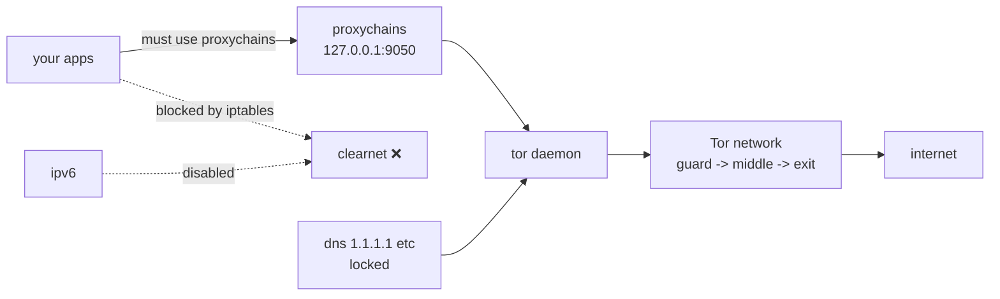

<div align="center">

# 🕵️ Anonyx
### stay private on Kali / Debian with Tor + kill-switch

[](./Anonyx.sh)
[](./Anonyx.sh)
[](https://www.torproject.org/)
[](https://www.kali.org/)
[](./LICENSE)


```text
  ___    _   _____  _   ___   ____  __
 / _ \  / | / / _ \/ | / / | / / / / /
/ / / |/  |/ / / / /  |/ /  |/ / / / /
/ /_/ / /|  / /_/ / /|  / /|  / /_/ /
\____/_/ |_/\____/_/ |_/_/ |_/\____/
         stay anonymous. stay free.
```

[Quick start](#-quick-start) • [How it works](#-how-it-works) • [Menu](#-menu) • [Leak check](#-leak-check) • [Troubleshooting](#-troubleshooting)

</div>

---

## ✨ what it does

| thing | how |
|---|---|
| 🧅 tor routing | socks `127.0.0.1:9050`, dnsport `5353`, hardened torrc |
| 🧱 kill-switch | iptables: only `debian-tor` + lo out, rest DROP. clearnet just fails (thats good) |
| 🔒 dns lock | writes anon dns + `chattr +i` so NetworkManager cant revert it |
| 🚫 ipv6 block | sysctl disable + ip6tables DROP, restored on disable |
| 🔍 leak check | tor ip vs clear ip, dns, ipv6, firewall proof |
| 🔄 new identity | restarts tor for fresh circuit / ip |
| 🚨 panic | cuts all net instantly |
| 💾 safe | backs up everything to `*.bak.anonyx` + `/var/lib/anonyx` |

> real talk: ISP / college still sees youre *using* Tor. And if you login to insta/gmail over Tor, youre not anon anymore. This tool stops accidental IP/DNS leaks, it doesnt make you invisible.

---

## 🚀 quick start

```bash
git clone https://github.com/Aryann019x/Anonymity-Tool.git
cd Anonymity-Tool
chmod +x Anonyx.sh

sudo ./Anonyx.sh --enable
proxychains4 curl https://check.torproject.org/api/ip
sudo ./Anonyx.sh --leaktest
```

more flags:

```bash
sudo ./Anonyx.sh --status    # tor + dns + ipv6 status
sudo ./Anonyx.sh --newid     # new tor circuit / ip
sudo ./Anonyx.sh --disable   # restore everything
sudo ./Anonyx.sh --panic     # cut net NOW
```

---

## 🧠 how it works



1. saves your clear IP to `/var/lib/anonyx/clear_ip` for later compare
2. backs up `torrc`, `proxychains4.conf`, `resolv.conf` once (wont overwrite good backup)
3. writes hardened torrc + locks dns
4. enables iptables kill-switch + disables ipv6
5. verifies via `check.torproject.org/api/ip` — if fail, auto-rolls back
6. on disable: restores files + iptables + ipv6

> without `proxychains4` most apps will timeout while enabled. thats the kill-switch working, not a bug.

---

## 🎛️ menu

```text
════════════════════════════════════
  Anonymity Tool Anonyx 2.1
  Created by: Aryann019x
════════════════════════════════════
[1] Enable Anonymity
[2] Disable Anonymity
[3] Show Status
[4] Leak check
[5] New identity
[6] Panic (cut net)
[7] Exit
════════════════════════════════════
```

---

## 🔍 leak check

`sudo ./Anonyx.sh --leaktest` shows something like:

```text
════ Leak check ════
✓ tor ip: 185.220.x.x
✓ tor ip differs from clear ip (103.44.x.x)
✓ dns looks ok
✓ ipv6 blocked/off
✓ firewall kill-switch active
✓ direct clearnet blocked (kill-switch working)
✓ no ipv6 leak
✓ no obvious leaks
```

if you see `✖ LEAK` or `direct net still works`, dont browse — run disable then enable again.

---

## 🗂️ files

- `Anonyx.sh` — the whole tool
- log: `/var/log/anonymity.log`
- state: `/var/lib/anonyx/` — `state`, `iptables.bak`, `clear_ip`
- backups: `/etc/tor/torrc.bak.anonyx`, `/etc/proxychains4.conf.bak.anonyx`, `/etc/resolv.conf.bak.anonyx`
- ports: socks `9050`, dns `5353`, trans `9040`, control `9051`
- dns: `1.1.1.1`, `9.9.9.9`, `208.67.222.222`

---

## 🛠️ requirements

- Kali or Debian-based, root (`sudo`)
- systemd preferred, falls back to `service tor` on WSL / non-systemd
- needs: `tor proxychains4 torsocks curl ufw iptables iproute2` (auto-installed)

---

## ❓ troubleshooting

<details>
<summary><b>net doesnt work after enable?</b></summary>

Normal if youre not using proxychains. Kill-switch blocks clearnet on purpose. Use `proxychains4 firefox` / `proxychains4 curl ...` or run `--leaktest` to confirm.

</details>

<details>
<summary><b>tor verification failed?</b></summary>

Wait 30s and retry — tor bootstrap is slow sometimes. Check `sudo systemctl status tor` and `/var/log/anonymity.log`. Tool auto-rolls back on fail.

</details>

<details>
<summary><b>dns keeps reverting?</b></summary>

Fixed in v2+ with `chattr +i`. If you edited resolv.conf manually, run `sudo chattr -i /etc/resolv.conf` then disable/enable again.

</details>

<details>
<summary><b>used panic, now no net?</b></summary>

Run `sudo ./Anonyx.sh --disable`. Reboot also clears iptables panic rules.

</details>

<details>
<summary><b>same IP after --newid?</b></summary>

Tor exits are limited, sometimes you get same exit. Wait a bit and try again.

</details>

---

## 🤝 contributing

found a bug? open an issue or PR. keep it simple, test on Kali VM if you touch iptables.

## 👤 author

**Aryann019x**

## 📄 license

MIT — see [LICENSE](./LICENSE)
