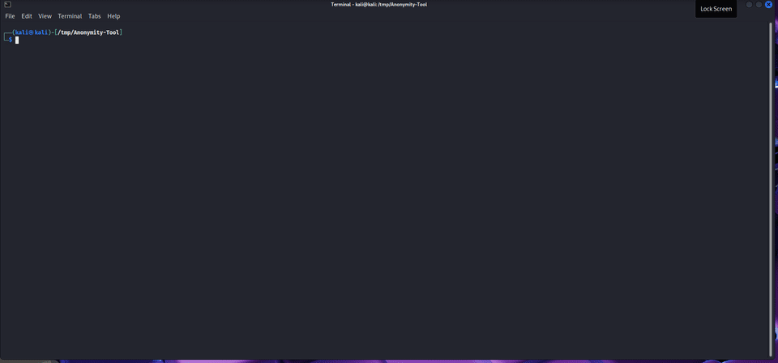

<div align="center">

# Anonyx

**Simple Tor anonymity toolkit for Kali Linux and Debian.**

Route CLI traffic through Tor, with kill-switch, DNS lock, and leak checks.

[](Anonyx.sh)
[](Anonyx.sh)
[](LICENSE)
[](https://github.com/Aryann019x/Anonymity-Tool/commits/main)

</div>

<br>

<p align="center">
  <a href="assets/anonyx-demo.gif"></a>
  <br>
  <em>Live demo: menu → enable → status → leak check → Tor proof (click to enlarge)</em>
</p>

---

## Contents

- [What it does](#what-it-does)
- [Quick start](#quick-start)
- [Usage](#usage)
- [How it works](#how-it-works)
- [Security notes](#security-notes)
- [Troubleshooting](#troubleshooting)
- [Credits](#credits)
- [License](#license)

---

## What it does

Anonyx is a single Bash script that:

1. Routes traffic through Tor (SOCKS `127.0.0.1:9050`)
2. Blocks everything else with an iptables kill-switch
3. Locks DNS so it can't leak or revert mid-session
4. Disables IPv6 while active (a common Tor bypass)
5. Checks for leaks and lets you get a fresh identity or cut the network instantly

> [!NOTE]
> Your ISP can still see you are using Tor. Logging into personal accounts will still identify you. Anonyx stops accidental leaks — it does not make you invisible.

Built for Kali Linux and Debian-based systems. Must run as root.

New to Tor? Start here: [Tor Project](https://www.torproject.org/) · [Tor FAQ](https://support.torproject.org/faq/) · [Whonix Do-Not list](https://www.whonix.org/wiki/DoNot)

---

## Quick start

```bash
git clone https://github.com/Aryann019x/Anonymity-Tool.git
cd Anonymity-Tool
chmod +x Anonyx.sh

sudo ./Anonyx.sh --enable
proxychains4 curl -s https://check.torproject.org/api/ip
sudo ./Anonyx.sh --leaktest
```

Watch the demo above for the full output. To stop and restore everything:

```bash
sudo ./Anonyx.sh --disable
```

---

## Usage

Run with no arguments for the interactive menu:

```bash
sudo ./Anonyx.sh
```

| Command | Description |
| --- | --- |
| `--enable` | Enable anonymity + kill-switch |
| `--disable` | Restore configs, firewall, IPv6 |
| `--status` | Show Tor, DNS, IPv6 status |
| `--leaktest` | Check IP, DNS, IPv6, firewall |
| `--newid` | Restart Tor for a new exit IP |
| `--panic` | Cut all network immediately |
| `--help`, `--version` | Help / version info |

> [!IMPORTANT]
> While enabled, use `proxychains4 <command>`. Direct connections timing out means the kill-switch is working — not a bug.

Dependencies (`tor`, `proxychains4`, `torsocks`, `curl`, `ufw`, `iptables`, `iproute2`) install automatically.

---

## How it works

```text
Your apps → proxychains (127.0.0.1:9050) → Tor → Internet
Clearnet traffic → blocked by iptables (DROP)
IPv6 → disabled for the session
DNS → locked to anon servers, verified after setup
```

Steps on `--enable`:

1. Saves your clear IP for later comparison
2. Backs up `torrc`, `proxychains4.conf`, `resolv.conf` (once, never overwrites a good backup)
3. Writes hardened Tor config, locks DNS with `chattr +i`
4. Applies kill-switch rules, disables IPv6
5. Verifies Tor — auto-restores everything on failure

On `--disable`, all files, firewall rules, and IPv6 settings are restored. Nothing else on the system is modified.

Details: SOCKS `9050` · DNSPort `5353` · TransPort `9040` · Control `9051` · DNS `1.1.1.1, 9.9.9.9, 208.67.222.222` · state in `/var/lib/anonyx/` · log at `/var/log/anonymity.log`

---

## Security notes

> [!WARNING]
> Anonyx is independent from Tor and carries no guarantee from the Tor Project. It guards against misconfiguration and accidental leaks — not malware or fingerprinting.

- **Hostname / MAC:** apps can still see these. Change them first if your threat includes the local network.
- **Tor over Tor:** don't run Tor Browser while Anonyx is active ([why](https://www.whonix.org/wiki/DoNot#Allow_Tor_over_Tor_Scenarios)).
- **Manual leak check:** `sudo ./Anonyx.sh --leaktest`, or with tcpdump: `sudo tcpdump -n -p -i eth0 not arp and not host <TOR_GUARD_IP>` — expect no traffic beyond headers.

---

## Troubleshooting

| Problem | Fix |
| --- | --- |
| No internet after enable | Use `proxychains4`. Clearnet is blocked by design. |
| Tor verification fails | Wait 30s, retry. Check `systemctl status tor` and `/var/log/anonymity.log`. |
| No network after panic | Run `sudo ./Anonyx.sh --disable` or reboot. |
| Same IP after `--newid` | Exit pool is small. Wait and retry. |
| DNS keeps reverting | v2.1 locks it. Run `sudo chattr -i /etc/resolv.conf`, then disable/enable. |

---

## Credits

- [Tor Project support](https://support.torproject.org/)
- [Whonix docs](https://www.whonix.org/wiki/Documentation)
- [Kalitorify](https://github.com/brainfucksec/kalitorify) / Parrot AnonSurf for the transparent-proxy approach

---

## License

MIT — see [LICENSE](LICENSE).
