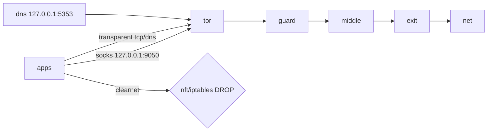

<div align="center">

# anonyx 3.0.0

**fail-closed Tor killswitch for Debian. nft first, verified exit, clean restore.**

[](https://github.com/Aryann019x/Anonymity-Tool/actions)
[](LICENSE)

</div>

<p align="center">
  <a href="assets/anonyx-demo.gif"></a>
  <br>
  <em>Real run on Kali: version → status → opsec → unit tests, slow pace (click to enlarge)</em>
</p>

## Architecture



nft table `inet anonyx` (or iptables compat). Optional netns `anonyx-tor` with veth + fwmark policy routing. State in `/run/tor-killswitch/state.json`, audit in `/var/log/tor-killswitch/audit.log` (append-only).

## Installation (Debian package)

```bash
sudo apt install tor curl nftables iptables iproute2 proxychains4
dpkg-buildpackage -us -uc
sudo dpkg -i ../anonyx_3.0.0-1_all.deb
sudo apt -f install
```

Or quick: `sudo make install`, then `sudo anonyx --doctor`.

## Configuration

```
sudo cp /etc/tor-killswitch/config.example /etc/tor-killswitch/config
# examples/: config.strict, config.paranoid
sudo anonyx --enable --mode strict
sudo anonyx --leaktest
sudo anonyx --restore
```

debconf asks mode + netns on install. NM dispatcher keeps DNS locked on GUI nets.

## Threat Model

Protects against:
- app leaks (CLI tool forgetting proxychains, direct curl burning home IP)
- DNS leaks (revert mid-session, clearnet :53, router DNS)
- IPv6 leaks (bypass around Tor socks)
- MAC tracking on LAN (paranoid randomizes, restores on --restore)
- ISP correlation of destinations (Tor exit hides target IP from ISP; ISP still sees Tor use)

Does NOT protect against:
- global passive adversaries watching guard + exit timing
- compromised Tor exits sniffing plain http (use https)
- browser fingerprinting (use Tor Browser for web, anonyx is CLI scope)
- clock skew breaking Tor (we warn, you run NTP)
- physical access / evil maid / BIOS

Required user OPSEC:
- Tor Browser for web browsing, anonyx for CLI only (no Tor-over-Tor)
- accurate time (chrony/systemd-timesyncd on, UTC preferred)
- no identity mixing (no personal logins over Tor exit)
- panic button needs gpio group: `sudo usermod -a -G gpio $USER` then re-login

## Security considerations

- fail-closed everywhere: no 80/443 fallback, no clearnet DNS, watchdog blocks if tor dies.
- torrc validated (no 0.0.0.0 binds, no relay ExitPolicy).
- clock check (Tor needs sane time), MAC randomize in paranoid, snowflake/obfs4 fallback when censored.
- systemd hardening: PrivateTmp, ProtectSystem=strict, seccomp via SystemCallFilter, AppArmor profile included.
- uninstall without reboot: `--restore` removes nft table, netns, DNS lock, MAC restore.

Full docs: `docs/`, `man anonyx`, `examples/`.
