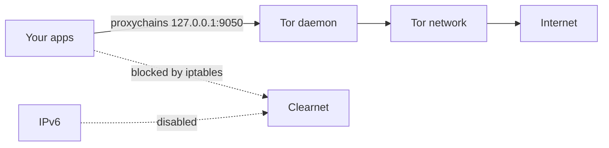

<div align="center">

# 🕵️ Anonyx

**Tor anonymity toolkit for Kali & Debian — kill-switch, DNS lock, IPv6 block, leak checks and panic mode.**

[](./Anonyx.sh)
[](./Anonyx.sh)
[](./LICENSE)
[](https://github.com/Aryann019x/Anonymity-Tool/commits/main)
[](https://github.com/Aryann019x/Anonymity-Tool/stargazers)
[](https://github.com/Aryann019x/Anonymity-Tool/forks)
[](https://github.com/Aryann019x/Anonymity-Tool/issues)

`Kali` • `Debian` • `Tor` • `iptables` • `proxychains`

[Quick Start](#-quick-start) •
[How It Works](#-how-it-works) •
[Usage](#-usage) •
[Leak Check](#-leak-check) •
[Troubleshooting](#-troubleshooting)

</div>

---

## ✨ Features

- 🧅 **Tor routing** — hardened `torrc`, SOCKS on `127.0.0.1:9050`, localhost only
- 🧱 **Kill-switch** — iptables allows only `debian-tor` + loopback out, rest `DROP`
- 🔒 **DNS lock** — anon DNS + `chattr +i` so NetworkManager can't revert it
- 🚫 **IPv6 block** — disabled via sysctl + ip6tables while enabled
- 🔍 **Leak checker** — Tor IP vs clear IP, DNS, IPv6 and firewall proof
- 🔄 **New identity** — fresh Tor circuit / exit IP in one command
- 🚨 **Panic mode** — cuts all networking instantly
- 💾 **Safe by default** — backs up configs to `*.bak.anonyx`, auto-rollback on failure
- 📝 **Logging** — everything goes to `/var/log/anonymity.log`

> Be real: your ISP still sees you're using Tor, and logging into personal accounts kills anonymity. Anonyx stops accidental IP / DNS / IPv6 leaks — it doesn't make you invisible.

---

## 🚀 Quick Start

```bash
git clone https://github.com/Aryann019x/Anonymity-Tool.git
cd Anonymity-Tool
chmod +x Anonyx.sh

# interactive menu
sudo ./Anonyx.sh

# or direct
sudo ./Anonyx.sh --enable
proxychains4 curl https://check.torproject.org/api/ip
sudo ./Anonyx.sh --leaktest
```

Demo session:

```bash
$ sudo ./Anonyx.sh --enable
🔹 Checking internet connection...
🔹 Enabling anonymity mode...
🔹 Setting up Tor...
🔹 Configuring ProxyChains...
🔹 Enabling kill-switch...
✓ Tor connection verified
✓ Anonymity enabled
tip: use proxychains4 for apps, else kill-switch will block them (thats normal)

$ sudo ./Anonyx.sh --leaktest
════ Leak check ════
✓ tor ip: 185.220.x.x
✓ tor ip differs from clear ip (103.44.x.x)
✓ direct clearnet blocked (kill-switch working)
✓ no ipv6 leak
✓ no obvious leaks
```

---

## 🧠 How It Works



1. Saves your clear IP for later comparison
2. Backs up `torrc`, `proxychains4.conf` and `resolv.conf` once
3. Writes hardened Tor config and locks DNS
4. Enables iptables kill-switch and disables IPv6
5. Verifies Tor via `check.torproject.org` — auto restores on failure
6. On disable: restores files, firewall and IPv6

Without `proxychains4` most apps will timeout while enabled. That's the kill-switch working, not a bug.

---

## 🎛️ Usage

| Command | What it does |
|---|---|
| `sudo ./Anonyx.sh` | Open interactive menu |
| `sudo ./Anonyx.sh --enable` | Enable anonymity + kill-switch |
| `sudo ./Anonyx.sh --disable` | Restore normal settings |
| `sudo ./Anonyx.sh --status` | Show Tor, DNS and IPv6 status |
| `sudo ./Anonyx.sh --leaktest` | Check for IP / DNS / IPv6 leaks |
| `sudo ./Anonyx.sh --newid` | Get a new Tor exit IP |
| `sudo ./Anonyx.sh --panic` | Cut all network immediately |
| `sudo ./Anonyx.sh --version` | Show version |

Menu:

```text
[1] Enable Anonymity
[2] Disable Anonymity
[3] Show Status
[4] Leak check
[5] New identity
[6] Panic (cut net)
[7] Exit
```

---

## 🔍 Leak Check

`sudo ./Anonyx.sh --leaktest` checks:

- Tor SOCKS is up and returns a Tor IP
- Tor IP differs from your saved clear IP
- DNS is anon servers only, not `192.168.x` / `127.0.0.53`
- IPv6 is disabled and `api6.ipify.org` is unreachable
- iptables is in `DROP` mode and direct clearnet fails

If you see `✖ LEAK`, don't browse — run `--disable` then `--enable` again.

---

## 🗂️ What It Touches

| Item | Value |
|---|---|
| SOCKS | `127.0.0.1:9050` |
| DNSPort | `127.0.0.1:5353` |
| TransPort | `127.0.0.1:9040` |
| Control | `9051` |
| DNS | `1.1.1.1`, `9.9.9.9`, `208.67.222.222` |
| Log | `/var/log/anonymity.log` |
| State | `/var/lib/anonyx/` |
| Backups | `*.bak.anonyx` for torrc, proxychains, resolv.conf |

Requirements: Kali / Debian, root, `tor proxychains4 torsocks curl ufw iptables iproute2` (auto-installed). Systemd preferred, falls back to `service tor`.

---

## ⚖️ Anonyx vs VPN vs Tor Browser

|  | Anonyx | VPN | Tor Browser |
|---|---|---|---|
| Hides IP from sites | Yes (via Tor) | Yes (via VPN server) | Yes |
| ISP sees Tor usage | Yes | No (sees VPN) | Yes |
| Kill-switch | Yes | Sometimes | No |
| DNS / IPv6 protection | Yes | Varies | Yes |
| No login tracking | You must still avoid logins | Same | Same |

Use Anonyx for system-wide CLI work. Use Tor Browser for web. Don't mix identities.

---

## ❓ Troubleshooting

<details>
<summary><b>Internet doesn't work after --enable</b></summary>

Expected unless you use proxychains. Try `proxychains4 curl https://check.torproject.org/api/ip`. Clearnet is blocked on purpose.

</details>

<details>
<summary><b>Tor verification failed</b></summary>

Tor bootstrap is slow. Wait 30s, check `sudo systemctl status tor` and `/var/log/anonymity.log`. The tool auto-rolls back on failure.

</details>

<details>
<summary><b>DNS keeps reverting</b></summary>

v2+ locks it with `chattr +i`. If you edited it manually, run `sudo chattr -i /etc/resolv.conf` then disable / enable again.

</details>

<details>
<summary><b>Used panic, now no network</b></summary>

Run `sudo ./Anonyx.sh --disable`. A reboot also clears panic rules.

</details>

<details>
<summary><b>Same IP after --newid</b></summary>

Exit pool is limited. Wait a bit and try again.

</details>

---

## 🗺️ Roadmap

- [x] Kill-switch + IPv6 block
- [x] Leak checker + panic mode
- [x] New identity
- [ ] Transparent proxy (no proxychains prefix needed)
- [ ] obfs4 bridge support for censored networks
- [ ] Config file `/etc/anonyx.conf`

---

## 🤝 Contributing

Found a bug? Open an issue or PR. If you touch iptables, please test in a Kali VM first.

## 👤 Author

**Aryann019x**

## 📄 License

MIT — see [LICENSE](./LICENSE)

<div align="center">

⭐ Star this repo if it helped you stay private.

</div>
